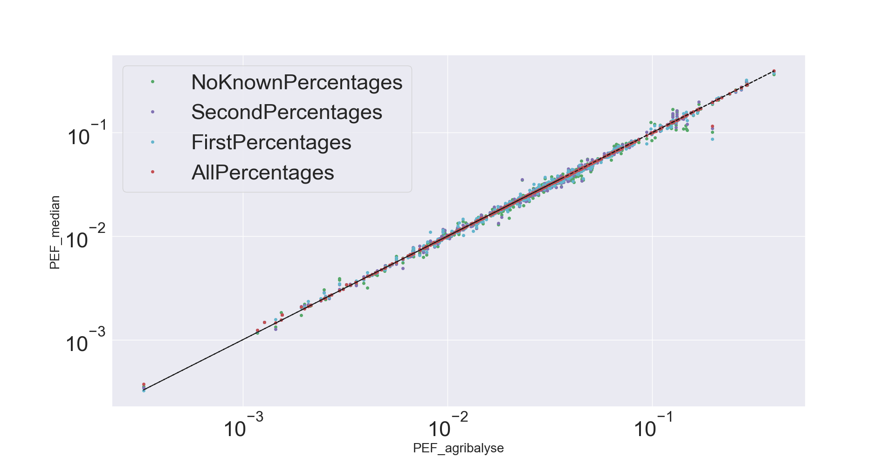
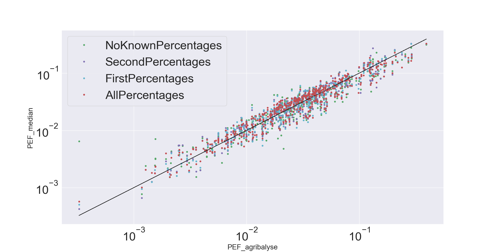

# Analysis of performance

This README is a work in progress, and currently mostly contains data received from @GustaveCoste about previous analysis.

## Datasets

A dataset containing a compatible version of each compound product in AgriBalyse was created.

In [test_dataset_nutri_calculated.json](test_dataset_nutri_calculated.json) the CIQUAL nutritional composition of the ingredients was used
to compute a nutritional table for each product, and then the ingredients and nutritional table was
used to compute environmental impacts.

In [test_dataset_nutri_from_ciqual.json](test_dataset_nutri_from_ciqual.json) the CIQUAL nutritional composition of the compound product itself was used, to get an unbiased (from this codebase) nutritional table, and then the ingredients and nutritional table was used to compute environmental impacts.

## Visualizations

This image shows a plot of computed vs reference (from AgriBalyse) EF impact of the compound products when the nutrient table was computed using this tool based on the CIQUAL composition of the ingredients.

This image shows a plot of computed vs reference (from AgriBalyse) EF impact of the compound products when the nutrient table of the product was taken from CIQUAL.

Unsurprisingly the correct ingredient mixture is harder to compute when the nutrient table doesn't match the one this tool would project for the perfectly correct mixture.

